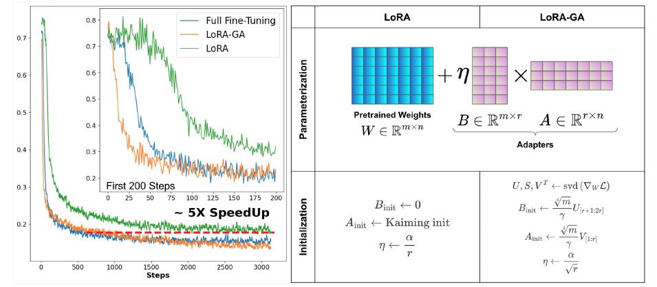

# [LoRA-GA: Low-Rank Adaptation with Gradient Approximation](https://arxiv.org/abs/2407.05000)

- [LoRA-GA: Low-Rank Adaptation with Gradient Approximation](#lora-ga-low-rank-adaptation-with-gradient-approximation)
  - [Overview](#overview)
  - [Quick start](#quick-start)
    - [1. Install custom peft](#1-install-custom-peft)
    - [2. Use LoRA-GA in peft](#2-use-lora-ga-in-peft)
    - [3. Explanation](#3-explanation)
  - [Examples](#examples)
    - [Multi-card training example](#multi-card-training-example)
  - [Note on Usage](#note-on-usage)
  - [Citation](#citation)

## Overview

We introduce a novel initialization method, LoRA-GA (Low Rank Adaptation with Gradient Approximation), which aligns the gradients of low-rank matrix product with those of full fine-tuning at the first step. Our extensive experiments demonstrate that LoRA-GA achieves a convergence rate comparable to that of full fine-tuning (hence being significantly faster than vanilla LoRA as well as various recent improvements) while simultaneously attaining comparable or even better performance.

(Left) Training loss curves of Llama 2-7B on MetaMathQA to training steps. LoRA-GA
converges as quickly as full fine-tuning and outperforms LoRA. (Right) Initialization procedures
used in LoRA and LoRA-GA. The key difference is that LoRA-GA initializes adapters using the
eigenvectors of the gradient matrix, as opposed to random initialization with a scaling factor.

## Quick start

### 1. Install custom peft

First, clone the LoRA-GA repository and install custom `peft`:

```bash
git clone https://github.com/Outsider565/LoRA-GA.git
cd LoRA-GA
pip install -e peft
```

### 2. Use LoRA-GA in peft

Here is an example of how to use LoRA-GA with peft in your code:

```python
from peft import PeftModel, LoraGAConfig, get_peft_model
from peft.utils.lora_ga_utils import estimate_gradient, LoraGAContext, save_loraga_model_init, save_loraga_model_final
# Configure LoRA-GA
peft_config = LoraGAConfig()
# Estimate gradients
named_grad = estimate_gradient(
    model=model,
    dataloader=dataloader,
    accelerator=accelerator,
    quant_flag=False,
)
# Use the LoraGAContext to attach named gradients to the model
with LoraGAContext(model=model, named_grad=named_grad):
    model = get_peft_model(model=model, peft_config=peft_config)
save_loraga_model_init(model, save_dir=save_dir)

"""
Train your model here using your favorite tool, e.g. PyTorch Lightning, Hugging Face Trainer, Pytorch Custom Training Loop, etc.
"""
# Save the final state of the LoRA-GA model
save_loraga_model_final(model, save_dir=save_dir)
# Load the saved model like you would load a LoRA model
model = PeftModel.from_pretrained(model, save_dir)
```

### 3. Explanation

- `LoraGAConfig`: A subclass of `LoraConfig`. It sets `peft_type` to `PeftType.LORAGA` and `init_lora_weights = "lora_ga"`.

- `estimate_gradient`: Uses the data in the dataloader for estimating gradient `named_grad`, which contains the name and gradient of the corresponding module.

- `LoraGAContext`: Attaches `named_grad` to model as an attribute(`model.named_grad`). After using named_grad to initialize LoraGAModel(LoraModel), LoraGAModel frees it.

- `get_peft_model:`: After initializing the model using `get_peft_model`, you can fine-tune it as you would with a default LoRA model.

Detailed usage(e.g. quantizaion model, api reference) see [Detailed usage](./doc/detail.md)

## Examples

```bash
python {python_file_path}
```

```bash
python ./examples/float_llama2-7b_metamath.py
```

| example name                                                                                 | python_file_path                         |
| -------------------------------------------------------------------------------------------- | ---------------------------------------- |
| [Training Llama2 7b on metamath QA](./examples/float_llama2-7b_metamath.py)                  | ./examples/float_llama2-7b_metamath.py   |
| [Training quantized 4bit Llama2 7b on metamath QA](./examples/quant4_llama-2-7b_metamath.py) | ./examples/quant4_llama-2-7b_metamath.py |
| [Training quantized 8bit Llama2 7b on metamath QA](./examples/quant8_llama-2-7b_metamath.py) | ./examples/quant8_llama-2-7b_metamath.py |
| [Training quantized 4bit Llama2 7b on Wizard-LM](./examples/quant4_llama-2-7b_wizard.py)     | ./examples/quant4_llama-2-7b_wizard.py   |
| [Training t5-base on sst2](./examples/float_t5_sst2.py)                                      | ./examples/float_t5_sst2.py              |

### Multi-card training example

This is an example of a single machine with 4 GPUs. If you want to use n GPUs in parallel,
you need to modify the `accelerate_config.yaml` file (or use `accelerate config` to regenerate the configuration file).

```bash
CUDA_VISIBLE_DEVICES="0,1,2,3" python -m accelerate.commands.launch \
--main_process_port $(shuf -i 10000-60000 -n 1) \
--config_file examples/accelerate_config.yaml \
{python_file_path}
```

 you can use command like this

```bash
CUDA_VISIBLE_DEVICES="0,1,2,3" python -m accelerate.commands.launch \
--main_process_port $(shuf -i 10000-60000 -n 1) \
--config_file examples/accelerate_config.yaml \
examples/float_llama2-7b_metamath.py
```

## Note on Usage

The `reproduce` directory contains legacy code intended solely for reproducing the results of the original paper. This is not the recommended approach for using LoRA-GA.

For a more numerically stable and convenient experience, we highly recommend using LoRA-GA through the our custom `peft` library. Detailed usage instructions can be found in the [Quick Start](#quick-start) above. This new API ensures better compatibility and ease of use.

## Citation

```
@misc{wang2024loragalowrankadaptationgradient,
    title={LoRA-GA: Low-Rank Adaptation with Gradient Approximation},
    author={Shaowen Wang and Linxi Yu and Jian Li},
    year={2024},
    eprint={2407.05000},
    archivePrefix={arXiv},
    primaryClass={cs.LG},
    url={https://arxiv.org/abs/2407.05000},
}
```
